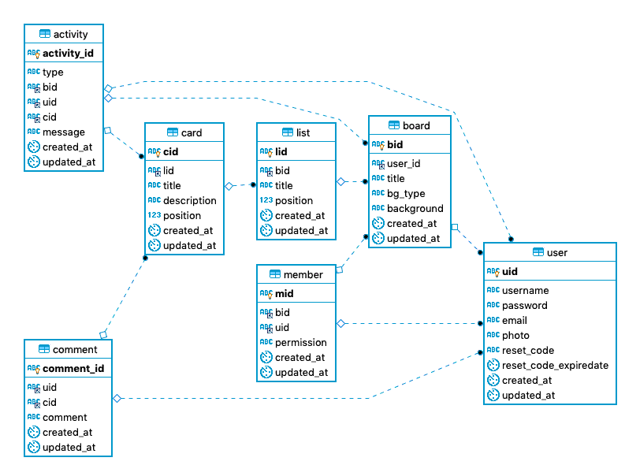

# Trello clone project ( API )   
Trello 클론 프로젝트의 API 서버이다. 개발은 `Node.js` 의 `express` 를 사용했다.

### 기능  
* 회원 관리 기능  
* 보드 CRUD  
* 리스트 CRUD  
* 카드 CRUD  
* 댓글 기능  
* Activity 생성 기능  

### 기능 구현

- [x] Model 정의
- [x] Controller 정의
- [x] Route 정의
- [x] user - 로그인 / 화원가입 
- [x] user - 회원 비밀 번호 변경 
- [x] user - 비밀번호 찾기 
- [x] board - 보드 조회 
- [x] board - 보드 수정 
- [x] board - 보드 삭제 
- [x] board - 보드 추가 
- [x] board - 배경 색상 변경 
- [x] board - 멤버 리스트 
- [x] board - 멤버 추가 
- [x] board - 멤버 삭제 
- [x] list - 리스트 조회 
- [x] list - 리스트 추가 
- [x] list - 리스트 삭제 
- [x] list - 리스트 타이틀 수정 
- [x] list - 리스트 이동 
- [x] card - 카드 조회 
- [x] card - 카드 추가 
- [x] card - 카드 삭제 
- [x] card - 카드 수정 
- [x] card - 카드 이동 
- [x] comment - 댓글 조회 
- [x] comment - 댓글 추가 
- [x] comment - 댓글 수정 
- [x] comment - 댓글 삭제 
- [x] activity - 이벤트 로그 저장 
- [x] activity - 이벤트 로그 조회  

### ER 다이어그램  



### Model

**User**

```javascript
{
  uid: {
    field: "uid",
    type: DataTypes.UUID,
    defaultValue: DataTypes.UUIDV4,
    primaryKey: true,
    allowNull: false
  },
  username: {
    field: "username",
    type: DataTypes.STRING(10),
    allowNull: false,
  },
  password: {
    field: "password",
    type: DataTypes.STRING(100),
    allowNull: false
  },
  email: {
    field: "email",
    type: DataTypes.STRING(50),
    allowNull: false,
  },
  photo: {
    field: "photo",
    type: DataTypes.STRING(20),
    allowNull: false
  },
  reset_code: {
    field: "reset_code",
    type: DataTypes.UUID,
    allowNull: true
  },
  reset_code_expiredate: {
    field: "reset_code_expiredate",
    type: DataTypes.DATE,
    allowNull: true
  }
}
```

**Board**

```javascript
{
  bid: {
    field: "bid",
    type: DataTypes.UUID,
    defaultValue: DataTypes.UUIDV4,
    primaryKey: true,
    allowNull: false
  },
  user_id: {
    field: "user_id",
    type: DataTypes.UUID,
    allowNull: false,
  },
  title: {
    field: "title",
    type: DataTypes.STRING(30),
    allowNull: false
  },
  bg_type: {
    field: "bg_type",
    type: DataTypes.ENUM,
    values: ['image', 'color'],
    defaultValue: 'color',
    allowNull: false
  },
  background: {
    field: "background",
    type: DataTypes.STRING(100),
    defaultValue: 'rgb(0, 121, 191)',
    allowNull: false
  }
}
```

**List**

```javascript
{
  lid: {
    field: "lid",
    type: DataTypes.UUID,
    defaultValue: DataTypes.UUIDV4,
    primaryKey: true,
    allowNull: false
  },
  bid: {
    field: "bid",
    type: DataTypes.UUID,
    allowNull: false,
  },
  title: {
    field: "title",
    type: DataTypes.STRING(30),
    allowNull: false
  },
  position: {
    field: "position",
    type: DataTypes.DOUBLE,
    allowNull: false,
    defaultValue: 65535
  }
}
```

**Card**

```javascript
{
  cid: {
    field: "cid",
    type: DataTypes.UUID,
    defaultValue: DataTypes.UUIDV4,
    primaryKey: true,
    allowNull: false
  },
  lid: {
    field: "lid",
    type: DataTypes.UUID,
    allowNull: false,
  },
  title: {
    field: "title",
    type: DataTypes.STRING(30),
    allowNull: false
  },
  description: {
    field: "description",
    type: DataTypes.STRING(500),
    allowNull: true
  },
  position: {
    field: "position",
    type: DataTypes.DOUBLE,
    allowNull: false,
    defaultValue: 65535
  }
}
```

**Comment**  

```javascript
{
  comment_id: {
    field: "comment_id",
    type: DataTypes.UUID,
    defaultValue: DataTypes.UUIDV4,
    primaryKey: true,
    allowNull: false
  },
  uid: {
    field: "uid",
    type: DataTypes.UUID,
    allowNull: false,
  },
  cid: {
    field: "cid",
    type: DataTypes.UUID,
    allowNull: false
  },
  comment: {
    field: "comment",
    type: DataTypes.STRING(50),
    allowNull: false
  }
}
```

**Activity**

```javascript
{
  activity_id: {
    field: "activity_id",
    type: DataTypes.UUID,
    defaultValue: DataTypes.UUIDV4,
    primaryKey: true,
    allowNull: false
  },
  type: {
    field: "type",
    type: DataTypes.ENUM,
    values: ['move', 'add', 'delete', 'edit', 'comment'],
    allowNull: false,
  },
  bid: {
    field: "bid",
    type: DataTypes.UUID,
    allowNull: false,
  },
  uid: {
    field: "uid",
    type: DataTypes.UUID,
    allowNull: false
  },
  cid: {
    field: "cid",
    type: DataTypes.UUID,
    allowNull: true
  },
  message: {
    field: "message",
    type: DataTypes.STRING(300),
    allowNull: false,
  }
}
```